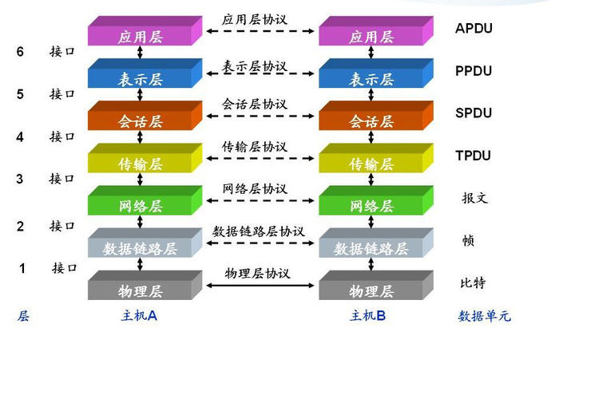
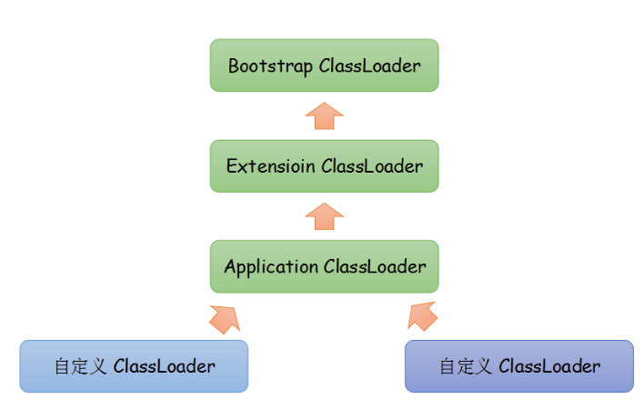

# HTTP 和 Socket 的区别  
  
要弄明白http和socket首先要熟悉网络七层：物 数 网 传 会 表 应，如图
  
    
   
HTTP 协议:超文本传输协议，对应于应用层，用于如何封装数据.

TCP/UDP 协议:传输控制协议，对应于传输层，主要解决数据在网络中的传输。

IP 协议:对应于网络层，同样解决数据在网络中的传输。

传输数据的时候只使用 TCP/IP 协议(传输层)，如果没有应用层来识别数据内容，传输后的协议都是无用的。

应用层协议很多 FTP,HTTP,TELNET等，可以自己定义应用层协议。

web 使用 HTTP 作传输层协议，以封装 HTTP 文本信息，然后使用 TCP/IP 做传输层协议，将数据发送到网络上。   
   
  
## 一、HTTP 协议   
   
http 为短连接：客户端发送请求都需要服务器端回送响应.请求结束后，主动释放链接，因此为短连接。通常的做法是，不需要任何数据，也要保持每隔一段时间向服务器发送"保持连接"的请求。这样可以保证客户端在服务器端是"上线"状态。

HTTP连接使用的是"请求-响应"方式，不仅在请求时建立连接，而且客户端向服务器端请求后，服务器才返回数据。
   
   
## 二、Socket 连接   
    
要想明白 Socket，必须要理解 TCP 连接。

TCP 三次握手：握手过程中并不传输数据，在握手后服务器与客户端才开始传输数据，理想状态下，TCP 连接一旦建立，在通讯双方中的任何一方主动断开连接之前 TCP 连接会一直保持下去。

Socket 是对 TCP/IP 协议的封装，Socket 只是个接口不是协议，通过 Socket 我们才能使用 TCP/IP 协议，除了 TCP，也可以使用 UDP 协议来传递数据。

创建 Socket 连接的时候，可以指定传输层协议，可以是 TCP 或者 UDP，当用 TCP 连接，该Socket就是个TCP连接，反之。  
    
### Socket 原理  
   
Socket 连接,至少需要一对套接字，分为 clientSocket，serverSocket 连接分为3个步骤:

(1) 服务器监听:服务器并不定位具体客户端的套接字，而是时刻处于监听状态；

(2) 客户端请求:客户端的套接字要描述它要连接的服务器的套接字，提供地址和端口号，然后向服务器套接字提出连接请求；

(3) 连接确认:当服务器套接字收到客户端套接字发来的请求后，就响应客户端套接字的请求,并建立一个新的线程,把服务器端的套接字的描述发给客户端。一旦客户端确认了此描述，就正式建立连接。而服务器套接字继续处于监听状态，继续接收其他客户端套接字的连接请求.    
    
**Socket为长连接**：通常情况下Socket 连接就是 TCP 连接，因此 Socket 连接一旦建立,通讯双方开始互发数据内容，直到双方断开连接。在实际应用中，由于网络节点过多，在传输过程中，会被节点断开连接，因此要通过轮询高速网络，该节点处于活跃状态。   
    
很多情况下，都是需要服务器端向客户端主动推送数据，保持客户端与服务端的实时同步。

若双方是 Socket 连接，可以由服务器直接向客户端发送数据。

若双方是 HTTP 连接，则服务器需要等客户端发送请求后，才能将数据回传给客户端。

因此，客户端定时向服务器端发送请求，不仅可以保持在线，同时也询问服务器是否有新数据，如果有就将数据传给客户端。    
    
   
## 双亲委派模型的理解   
   
双亲委派模型   
>Java虚拟机先从最核心的API开始查找，防止不可信的类扮演被信任的类。
  
类加载器就是根据指定全限定名称将class文件加载到JVM内存，转为Class对象。如果站在JVM的角度来看，只存在两种类加载器:   
   
* 启动类加载器（Bootstrap ClassLoader）：由C++语言实现（针对HotSpot）,负责将存放在<JAVA_HOME>\lib目录或-Xbootclasspath参数指定的路径中的类库加载到内存中。

* 其他类加载器：由Java语言实现，继承自抽象类ClassLoader。如：  
	* 扩展类加载器（Extension ClassLoader）：负责加载<JAVA_HOME>\lib\ext目录或java.ext.dirs系统变量指定的路径中的所有类库。
	* 应用程序类加载器（Application ClassLoader）。负责加载用户类路径（classpath）上的指定类库，我们可以直接使用这个类加载器。一般情况，如果我们没有自定义类加载器默认就是用这个加载器。   

   
双亲委派模型工作过程是：如果一个类加载器收到类加载的请求，它首先不会自己去尝试加载这个类，而是把这个请求委派给父类加载器完成。每个类加载器都是如此，只有当父加载器在自己的搜索范围内找不到指定的类时（即ClassNotFoundException），子加载器才会尝试自己去加载。   
    
  
     
   
而有了双亲委派模型，黑客自定义的java.lang.String类永远都不会被加载进内存。因为首先是最顶端的类加载器加载系统的java.lang.String类，最终自定义的类加载器无法加载java.lang.String类。

或许你会想，我在自定义的类加载器里面强制加载自定义的java.lang.String类，不去通过调用父加载器不就好了吗?确实，这样是可行。但是，在JVM中，判断一个对象是否是某个类型时，如果该对象的实际类型与待比较的类型的类加载器不同，那么会返回false。   
   
