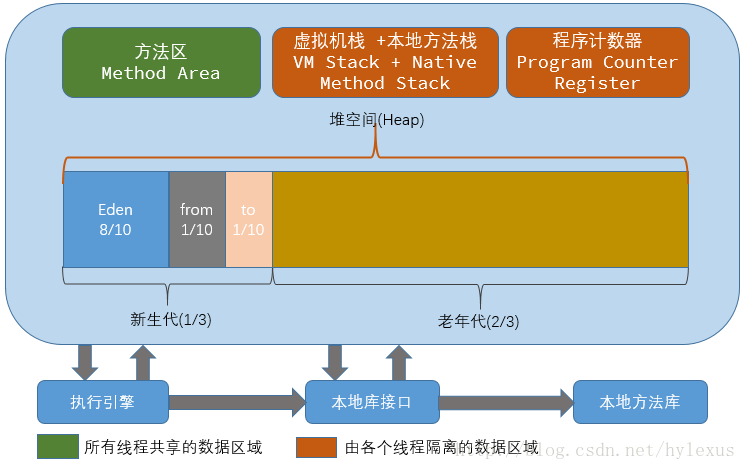

## ConcurrentHashMap原理分析
  
### 线程不安全的HashMap
  
因为多线程环境下，使用Hashmap进行put操作会引起死循环，导致CPU利用率接近100%，所以在并发情况下不能使用HashMap。   
   
### 效率低下的HashTable容器    
   
HashTable容器使用synchronized来保证线程安全，但在线程竞争激烈的情况下HashTable的效率非常低下。因为当一个线程访问HashTable的同步方法时，其他线程访问HashTable的同步方法时，可能会进入阻塞或轮询状态。如线程1使用put进行添加元素，线程2不但不能使用put方法添加元素，并且也不能使用get方法来获取元素，所以竞争越激烈效率越低。   
   
### 锁分段技术   
   
HashTable容器在竞争激烈的并发环境下表现出效率低下的原因，是因为所有访问HashTable的线程都必须竞争同一把锁，那假如容器里有多把锁，每一把锁用于锁容器其中一部分数据，那么当多线程访问容器里不同数据段的数据时，线程间就不会存在锁竞争，从而可以有效的提高并发访问效率，这就是ConcurrentHashMap所使用的锁分段技术，首先将数据分成一段一段的存储，然后给每一段数据配一把锁，当一个线程占用锁访问其中一个段数据的时候，其他段的数据也能被其他线程访问。有些方法需要跨段，比如size()和containsValue()，它们可能需要锁定整个表而而不仅仅是某个段，这需要按顺序锁定所有段，操作完毕后，又按顺序释放所有段的锁。这里“按顺序”是很重要的，否则极有可能出现死锁，在ConcurrentHashMap内部，段数组是final的，并且其成员变量实际上也是final的，但是，仅仅是将数组声明为final的并不保证数组成员也是final的，这需要实现上的保证。这可以确保不会出现死锁，因为获得锁的顺序是固定的。   
   

    
   
ConcurrentHashMap是由Segment数组结构和HashEntry数组结构组成。Segment是一种可重入锁ReentrantLock，在ConcurrentHashMap里扮演锁的角色，HashEntry则用于存储键值对数据。一个ConcurrentHashMap里包含一个Segment数组，Segment的结构和HashMap类似，是一种数组和链表结构， 一个Segment里包含一个HashEntry数组，每个HashEntry是一个链表结构的元素， 每个Segment守护者一个HashEntry数组里的元素,当对HashEntry数组的数据进行修改时，必须首先获得它对应的Segment锁。    
    
### 应用场景   
   
当有一个大数组时需要在多个线程共享时就可以考虑是否把它给分层多个节点了，避免大锁。并可以考虑通过hash算法进行一些模块定位。   
其实不止用于线程，当设计数据表的事务时（事务某种意义上也是同步机制的体现），可以把一个表看成一个需要同步的数组，如果操作的表数据太多时就可以考虑事务分离了（这也是为什么要避免大表的出现），比如把数据进行字段拆分，水平分表等.    
   
   
## Java8移除永久代    
    
其目的是Hotspot JVM和JRockit JVM相融合的设计思路。
转移位置：  将java类部分放到java heap里，将字符串常量和类中的静态变量放到内存里面。

在JDK1.7中, 已经把原本放在永久代的字符串常量池移出, 放在堆中. 为什么这样做呢? 因为使用永久代来实现方法区不是个好主意, 很容易遇到内存溢出的问题. 我们通常使用PermSize和MaxPermSize设置永久代的大小, 这个大小就决定了永久代的上限, 但是我们不是总是知道应该设置为多大的, 如果使用默认值容易遇到OOM错误.

类的元数据, 字符串池, 类的静态变量将会从永久代移除, 放入Java heap或者native memory. 其中建议JVM的实现中将类的元数据放入 native memory, 将字符串池和类的静态变量放入java堆中. 这样可以加载多少类的元数据就不在由MaxPermSize控制, 而由系统的实际可用空间来控制.

为什么这么做呢? 减少OOM只是表因, 更深层的原因还是要合并HotSpot和JRockit的代码, JRockit从来没有一个叫永久代的东西, 但是运行良好, 也不需要开发运维人员设置这么一个永久代的大小.

当然不用担心运行性能问题了, 在覆盖到的测试中, 程序启动和运行速度降低不超过1%, 但是这一点性能损失换来了更大的安全保障.    
   
   
### 永久代（PermGen）在哪里？   
   
根据，hotspot jvm结构如下(虚拟机栈和本地方法栈合一起了)：   
  
    
  
  
上图引自网络，但有个问题：方法区和heap堆都是线程共享的内存区域。    
   
**关于方法区和永久代：**

在HotSpot JVM中，这次讨论的永久代，就是上图的方法区（JVM规范中称为方法区）。《Java虚拟机规范》只是规定了有方法区这么个概念和它的作用，并没有规定如何去实现它。在其他JVM上不存在永久代。    
    
**JDK8永久代的废弃**   
   
   
   
1.新生代：Eden+From Survivor+To Survivor

2.老年代：OldGen

3.永久代（方法区的实现） : PermGen----->替换为Metaspace(本地内存中)   
   
   
## java 堆栈的区别   
   
Java把内存分成两种，一种叫做栈内存，一种叫做堆内存   
   
在函数中定义的**一些基本类型的变量和对象的引用变量都是在函数的栈内存中分配。**当在一段代码块中定义一个变量时，java就在栈中为这个变量分配内存空间，当超过变量的作用域后，java会自动释放掉为该变量分配的内存空间，该内存空间可以立刻被另作他用。   
   
**堆内存用于存放由new创建的对象和数组。**在堆中分配的内存，由java虚拟机自动垃圾回收器来管理。在堆中产生了一个数组或者对象后，还可以在栈中定义一个特殊的变量，这个变量的取值等于数组或者对象在堆内存中的首地址，在栈中的这个特殊的变量就变成了数组或者对象的引用变量，以后就可以在程序中使用栈内存中的引用变量来访问堆中的数组或者对象，引用变量相当于为数组或者对象起的一个别名，或者代号。   
   
   
引用变量是普通变量，定义时在栈中分配内存，引用变量在程序运行到作用域外释放。而数组＆对象本身在堆中分配，即使程序运行到使用new产生数组和对象的语句所在地代码块之外，数组和对象本身占用的堆内存也不会被释放，**数组和对象在没有引用变量指向它的时候，才变成垃圾，不能再被使用，但是仍然占着内存，在随后的一个不确定的时间被垃圾回收器释放掉。这个也是java比较占内存的主要原因。**实际上，栈中的变量指向堆内存中的变量，这就是 Java 中的指针!    
    
### java中内存分配策略及堆和栈的比较  
   
**1 内存分配策略** 

按照编译原理的观点,程序运行时的内存分配有三种策略,分别是静态的,栈式的,和堆式的. 

静态存储分配是指在编译时就能确定每个数据目标在运行时刻的存储空间需求,因而在编译时就可以给他们分配固定的内存空间.这种分配策略要求程序代码中不允许有可变数据结构(比如可变数组)的存在,也不允许有嵌套或者递归的结构出现,因为它们都会导致编译程序无法计算准确的存储空间需求. 

栈式存储分配也可称为动态存储分配,是由一个类似于堆栈的运行栈来实现的.和静态存储分配相反,在栈式存储方案中,程序对数据区的需求在编译时是完全未知的,只有到运行的时候才能够知道,但是规定在运行中进入一个程序模块时,必须知道该程序模块所需的数据区大小才能够为其分配内存.和我们在数据结构所熟知的栈一样,栈式存储分配按照先进后出的原则进行分配。 

静态存储分配要求在编译时能知道所有变量的存储要求,栈式存储分配要求在过程的入口处必须知道所有的存储要求,而堆式存储分配则专门负责在编译时或运行时模块入口处都无法确定存储要求的数据结构的内存分配,比如可变长度串和对象实例.堆由大片的可利用块或空闲块组成,堆中的内存可以按照任意顺序分配和释放.    
   
   
**2 堆和栈的比较** 

上面的定义从编译原理的教材中总结而来,除静态存储分配之外,都显得很呆板和难以理解,下面撇开静态存储分配,集中比较堆和栈: 

从堆和栈的功能和作用来通俗的比较,堆主要用来存放对象的，栈主要是用来执行程序的.而这种不同又主要是由于堆和栈的特点决定的: 

在编程中，例如C/C++中，所有的方法调用都是通过栈来进行的,所有的局部变量,形式参数都是从栈中分配内存空间的。实际上也不是什么分配,只是从栈顶向上用就行,就好像工厂中的传送带(conveyor belt)一样,Stack Pointer会自动指引你到放东西的位置,你所要做的只是把东西放下来就行.退出函数的时候，修改栈指针就可以把栈中的内容销毁.这样的模式速度最快, 当然要用来运行程序了.需要注意的是,在分配的时候,比如为一个即将要调用的程序模块分配数据区时,应事先知道这个数据区的大小,也就说是虽然分配是在程序运行时进行的,但是分配的大小多少是确定的,不变的,而这个"大小多少"是在编译时确定的,不是在运行时. 

堆是应用程序在运行的时候请求操作系统分配给自己内存，由于从操作系统管理的内存分配,所以在分配和销毁时都要占用时间，因此用堆的效率非常低.但是堆的优点在于,编译器不必知道要从堆里分配多少存储空间，也不必知道存储的数据要在堆里停留多长的时间,因此,用堆保存数据时会得到更大的灵活性。事实上,面向对象的多态性,堆内存分配是必不可少的,因为多态变量所需的存储空间只有在运行时创建了对象之后才能确定.在C++中，要求创建一个对象时，只需用 new命令编制相关的代码即可。执行这些代码时，会在堆里自动进行数据的保存.当然，为达到这种灵活性，必然会付出一定的代价:在堆里分配存储空间时会花掉更长的时间!这也正是导致我们刚才所说的效率低的原因,看来列宁同志说的好,人的优点往往也是人的缺点,人的缺点往往也是人的优点(晕~).     
   
   
**3 JVM中的堆和栈** 

JVM是基于堆栈的虚拟机.JVM为每个新创建的线程都分配一个堆栈.也就是说,对于一个Java程序来说，它的运行就是通过对堆栈的操作来完成的。堆栈以帧为单位保存线程的状态。JVM对堆栈只进行两种操作:以帧为单位的压栈和出栈操作。 

我们知道,某个线程正在执行的方法称为此线程的当前方法.我们可能不知道,当前方法使用的帧称为当前帧。当线程激活一个Java方法,JVM就会在线程的 Java堆栈里新压入一个帧。这个帧自然成为了当前帧.在此方法执行期间,这个帧将用来保存参数,局部变量,中间计算过程和其他数据.这个帧在这里和编译原理中的活动纪录的概念是差不多的. 

从Java的这种分配机制来看,堆栈又可以这样理解:堆栈(Stack)是操作系统在建立某个进程时或者线程(在支持多线程的操作系统中是线程)为这个线程建立的存储区域，该区域具有先进后出的特性。 

每一个Java应用都唯一对应一个JVM实例，每一个实例唯一对应一个堆。应用程序在运行中所创建的所有类实例或数组都放在这个堆中,并由应用所有的线程共享.跟C/C++不同，Java中分配堆内存是自动初始化的。Java中所有对象的存储空间都是在堆中分配的，但是这个对象的引用却是在堆栈中分配,也就是说在建立一个对象时从两个地方都分配内存，在堆中分配的内存实际建立这个对象，而在堆栈中分配的内存只是一个指向这个堆对象的指针(引用)而已。 