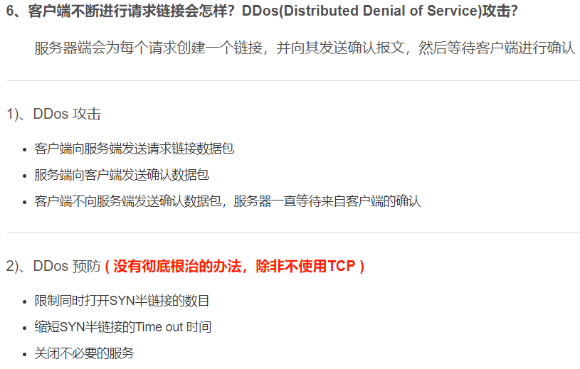
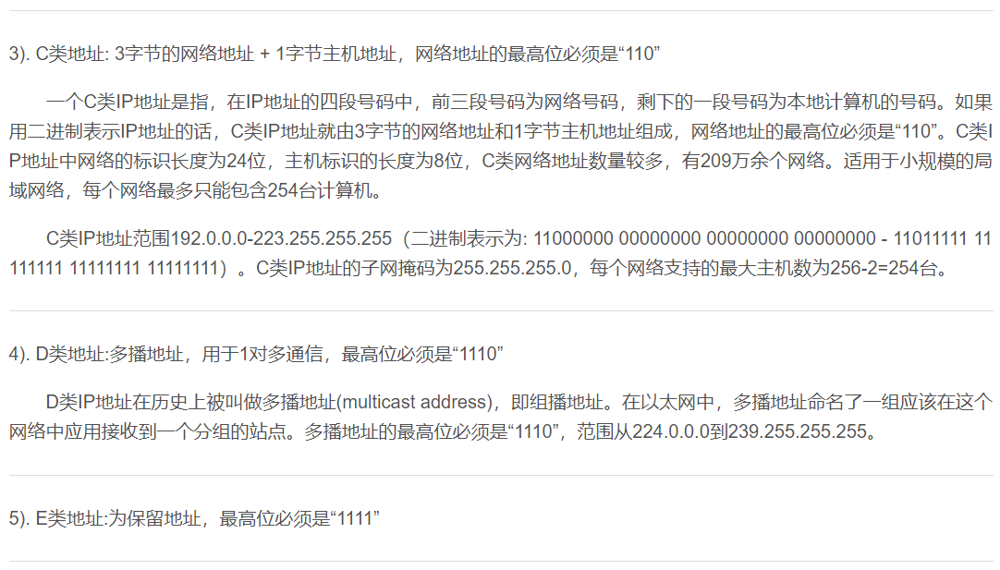

# 计算机网络面试问题集锦  

## TCP的三次握手四次挥手
  
### 建立连接协议（三次握手）
  
* 1. 客户端发送一个带SYN标志的TCP报文到服务器。这是三次握手过程中的报文1。
* 2. 服务器端回应客户端的，这是三次握手中的第2个报文，这个报文同时带ACK标志和SYN标志。因此它表示对刚才客户端SYN报文的回应；同时又标志SYN给客户端，询问客户端是否准备好进行数据通讯。
* 3. 客户必须再次回应服务段一个ACK报文，这是报文段3   

    
   
### 连接终止协议（四次挥手）    
   
>由于TCP连接是全双工的，因此每个方向都必须单独进行关闭。这原则是当一方完成它的数据发送任务后就能发送一个FIN来终止这个方向的连接。收到一个 FIN只意味着这一方向上没有数据流动，一个TCP连接在收到一个FIN后仍能发送数据。首先进行关闭的一方将执行主动关闭，而另一方执行被动关闭。    

（1） TCP客户端发送一个FIN，用来关闭客户到服务器的数据传送（报文段4）。   
（2） 服务器收到这个FIN，它发回一个ACK，确认序号为收到的序号加1（报文段5）。和SYN一样，一个FIN将占用一个序号。    
（3） 服务器关闭客户端的连接，发送一个FIN给客户端（报文段6）。   
（4） 客户端发回ACK报文确认，并将确认序号设置为收到序号加1（报文段7）。    
    
  
      
     

   
### 6. TCP和UDP的区别？

TCP提供面向连接的、可靠的数据流传输，而UDP提供的是非面向连接的、不可靠的数据流传输。

TCP传输单位称为TCP报文段，UDP传输单位称为用户数据报。

TCP注重数据安全性，UDP数据传输快，因为不需要连接等待，少了许多操作，但是其安全性却一般。    
   
  
    
   
  
    
   
### 7. Http和Https的区别

Http协议运行在TCP之上，明文传输，客户端与服务器端都无法验证对方的身份；Https是身披SSL(Secure Socket Layer)外壳的Http，运行于SSL上，SSL运行于TCP之上，是添加了加密和认证机制的HTTP。二者之间存在如下不同：

端口不同：Http与Https使用不同的连接方式，用的端口也不一样，前者是80，后者是443；

资源消耗：和HTTP通信相比，Https通信会由于加减密处理消耗更多的CPU和内存资源；

开销：Https通信需要证书，而证书一般需要向认证机构购买； 
　 
Https的加密机制是一种共享密钥加密和公开密钥加密并用的混合加密机制。   
   
  
### 8. 对称加密与非对称加密

对称密钥加密是指加密和解密使用同一个密钥的方式，这种方式存在的最大问题就是密钥发送问题，即如何安全地将密钥发给对方；而非对称加密是指使用一对非对称密钥，即公钥和私钥，公钥可以随意发布，但私钥只有自己知道。发送密文的一方使用对方的公钥进行加密处理，对方接收到加密信息后，使用自己的私钥进行解密。

由于非对称加密的方式不需要发送用来解密的私钥，所以可以保证安全性；但是和对称加密比起来，它非常的慢，所以我们还是要用对称加密来传送消息，但对称加密所使用的密钥我们可以通过非对称加密的方式发送出去。
   
   
### 9. 为什么TCP链接需要三次握手，两次不可以么，为什么？

为了防止 已失效的链接请求报文突然又传送到了服务端，因而产生错误。

客户端发出的连接请求报文并未丢失，而是在某个网络节点长时间滞留了，以致延误到链接释放以后的某个时间才到达Server。这是，Server误以为这是Client发出的一个新的链接请求，于是就向客户端发送确认数据包，同意建立链接。若不采用“三次握手”，那么只要Server发出确认数据包，新的链接就建立了。由于client此时并未发出建立链接的请求，所以其不会理睬Server的确认，也不与Server通信；而这时Server一直在等待Client的请求，这样Server就白白浪费了一定的资源。若采用“三次握手”，在这种情况下，由于Server端没有收到来自客户端的确认，则就会知道Client并没有要求建立请求，就不会建立链接。    
   
  
    
   
  
   
   
  
   
   
   
    
   
  
    
   
  
    
   
  
    
   
   
    
  
   
    
   
   
     
   
  
    
   
   
   
   
  
   
   
  
   
   
  
   
   
  
   
   
  
  
   
  
 
   
  
 
   
  
 
   
  
   
   
  
### HTTP请求的header头解析   
   
   
Request Headers：

下图是我访问一个URL：http://www.hzau.edu.cn的一个header,根据具体实例来分析一下各部分的功能及其作用。

 

 

Accept

作用： 浏览器端可以接受的媒体类型,

例如：  Accept: text/html  代表浏览器可以接受服务器回发的类型为 text/html  也就是我们常说的html文档,

如果服务器无法返回text/html类型的数据,服务器应该返回一个406错误(non acceptable)

通配符 * 代表任意类型

例如  Accept: */*  代表浏览器可以处理所有类型,(一般浏览器发给服务器都是发这个)

 

Accept-Encoding：

作用： 浏览器申明自己接收的编码方法，通常指定压缩方法，是否支持压缩，支持什么压缩方法（gzip，deflate），（注意：这不是只字符编码）;

例如： Accept-Encoding: zh-CN,zh;q=0.8

 

Accept-Language

作用： 浏览器申明自己接收的语言。 

语言跟字符集的区别：中文是语言，中文有多种字符集，比如big5，gb2312，gbk等等；

例如： Accept-Language: en-us

 

Connection

例如：　Connection: keep-alive   当一个网页打开完成后，客户端和服务器之间用于传输HTTP数据的TCP连接不会关闭，如果客户端再次访问这个服务器上的网页，会继续使用这一条已经建立的连接

例如：  Connection: close  代表一个Request完成后，客户端和服务器之间用于传输HTTP数据的TCP连接会关闭， 当客户端再次发送Request，需要重新建立TCP连接。

 

Host（发送请求时，该报头域是必需的）

作用: 请求报头域主要用于指定被请求资源的Internet主机和端口号，它通常从HTTP URL中提取出来的

例如: 我们在浏览器中输入：http://www.hzau.edu.cn

浏览器发送的请求消息中，就会包含Host请求报头域，如下：

Host：www.hzau.edu.cn

此处使用缺省端口号80，若指定了端口号，则变成：Host：指定端口号

 

Referer

当浏览器向web服务器发送请求的时候，一般会带上Referer，告诉服务器我是从哪个页面链接过来的，服务器籍此可以获得一些信息用于处理。比如从我主页上链接到一个朋友那里，他的服务器就能够从HTTP Referer中统计出每天有多少用户点击我主页上的链接访问他的网站。

 

User-Agent

作用：告诉HTTP服务器， 客户端使用的操作系统和浏览器的名称和版本.

我们上网登陆论坛的时候，往往会看到一些欢迎信息，其中列出了你的操作系统的名称和版本，你所使用的浏览器的名称和版本，这往往让很多人感到很神奇，实际上，服务器应用程序就是从User-Agent这个请求报头域中获取到这些信息User-Agent请求报头域允许客户端将它的操作系统、浏览器和其它属性告诉服务器。

例如： User-Agent: Mozilla/4.0 (compatible; MSIE 8.0; Windows NT 5.1; Trident/4.0; CIBA; .NET CLR 2.0.50727; .NET CLR 3.0.4506.2152; .NET CLR 3.5.30729; .NET4.0C; InfoPath.2; .NET4.0E)

 

 

另外，访问一些其他的URL的时候，request 的Header里面一些其他的字段，下面来进行列举：

比如我在登录一个需要用户名密码登录的网站时Request Header里面就有上面还没有提到过的字段。

如图所示：

 

 

Cache-Control

我们网页的缓存控制是由HTTP头中的“Cache-control”来实现的，常见值有private、no-cache、max-age、must-revalidate等，默认为private。这几种值的作用是根据重新查看某一页面时不同的方式来区分的：

（1）、打开新窗口

值为private、no-cache、must-revalidate，那么打开新窗口访问时都会重新访问服务器。而如果指定了max-age值（单位为秒），那么在此值内的时间里就不会重新访问服务器，例如：

Cache-control: max-age=5(表示当访问此网页后的5秒内再次访问不会去服务器)

（2）、在地址栏回车

值为private或must-revalidate则只有第一次访问时会访问服务器，以后就不再访问。

值为no-cache，那么每次都会访问。

值为max-age，则在过期之前不会重复访问。

（3）、按后退按扭

值为private、must-revalidate、max-age，则不会重访问，

值为no-cache，则每次都重复访问

（4）、按刷新按扭

无论为何值，都会重复访问

 

Cookie

Cookie是用来存储一些用户信息以便让服务器辨别用户身份的（大多数需要登录的网站上面会比较常见），比如cookie会存储一些用户的用户名和密码，当用户登录后就会在客户端产生一个cookie来存储相关信息，这样浏览器通过读取cookie的信息去服务器上验证并通过后会判定你是合法用户，从而允许查看相应网页。当然cookie里面的数据不仅仅是上述范围，还有很多信息可以存储是cookie里面，比如sessionid等。

 

If-Modified-Since

作用： 把浏览器端缓存页面的最后修改时间发送到服务器去，服务器会把这个时间与服务器上实际文件的最后修改时间进行对比。如果时间一致，那么返回304，客户端就直接使用本地缓存文件。如果时间不一致，就会返回200和新的文件内容。客户端接到之后，会丢弃旧文件，把新文件缓存起来，并显示在浏览器中.

例如：Mon, 17 Aug 2015 12:03:33 GMT

 

If-None-Match

作用: If-None-Match和ETag一起工作，工作原理是在HTTP Response中添加ETag信息。 当用户再次请求该资源时，将在HTTP Request 中加入If-None-Match信息(ETag的值)。如果服务器验证资源的ETag没有改变（该资源没有更新），将返回一个304状态告诉客户端使用本地缓存文件。否则将返回200状态和新的资源和Etag.  使用这样的机制将提高网站的性能

例如: If-None-Match: W/"3119-1437038474000"    
   
    
### HTTP与HTTPS的区别   
   
超文本传输协议HTTP协议被用于在Web浏览器和网站服务器之间传递信息，HTTP协议以明文方式发送内容，不提供任何方式的数据加密，如果攻击者截取了Web浏览器和网站服务器之间的传输报文，就可以直接读懂其中的信息，因此，HTTP协议不适合传输一些敏感信息，比如：信用卡号、密码等支付信息。

为了解决HTTP协议的这一缺陷，需要使用另一种协议：安全套接字层超文本传输协议HTTPS，为了数据传输的安全，HTTPS在HTTP的基础上加入了SSL协议，SSL依靠证书来验证服务器的身份，并为浏览器和服务器之间的通信加密。    
   
   
#### 一、HTTP和HTTPS的基本概念

HTTP：是互联网上应用最为广泛的一种网络协议，是一个客户端和服务器端请求和应答的标准（TCP），用于从WWW服务器传输超文本到本地浏览器的传输协议，它可以使浏览器更加高效，使网络传输减少。

HTTPS：是以安全为目标的HTTP通道，简单讲是HTTP的安全版，即HTTP下加入SSL层，HTTPS的安全基础是SSL，因此加密的详细内容就需要SSL。

HTTPS协议的主要作用可以分为两种：一种是建立一个信息安全通道，来保证数据传输的安全；另一种就是确认网站的真实性。   
   
  
#### 二、HTTP与HTTPS有什么区别？

HTTP协议传输的数据都是未加密的，也就是明文的，因此使用HTTP协议传输隐私信息非常不安全，为了保证这些隐私数据能加密传输，于是网景公司设计了SSL（Secure Sockets Layer）协议用于对HTTP协议传输的数据进行加密，从而就诞生了HTTPS。简单来说，HTTPS协议是由SSL+HTTP协议构建的可进行加密传输、身份认证的网络协议，要比http协议安全。

HTTPS和HTTP的区别主要如下：

1、https协议需要到ca申请证书，一般免费证书较少，因而需要一定费用。

2、http是超文本传输协议，信息是明文传输，https则是具有安全性的ssl加密传输协议。

3、http和https使用的是完全不同的连接方式，用的端口也不一样，前者是80，后者是443。

4、http的连接很简单，是无状态的；HTTPS协议是由SSL+HTTP协议构建的可进行加密传输、身份认证的网络协议，比http协议安全。   
   
  
    
   
   
    
   
  
#### 五、HTTPS的缺点

虽然说HTTPS有很大的优势，但其相对来说，还是存在不足之处的：

（1）HTTPS协议握手阶段比较费时，会使页面的加载时间延长近50%，增加10%到20%的耗电；

（2）HTTPS连接缓存不如HTTP高效，会增加数据开销和功耗，甚至已有的安全措施也会因此而受到影响；

（3）SSL证书需要钱，功能越强大的证书费用越高，个人网站、小网站没有必要一般不会用。

（4）SSL证书通常需要绑定IP，不能在同一IP上绑定多个域名，IPv4资源不可能支撑这个消耗。

（5）HTTPS协议的加密范围也比较有限，在黑客攻击、拒绝服务攻击、服务器劫持等方面几乎起不到什么作用。最关键的，SSL证书的信用链体系并不安全，特别是在某些国家可以控制CA根证书的情况下，中间人攻击一样可行。   
   
  
