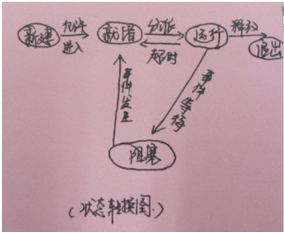
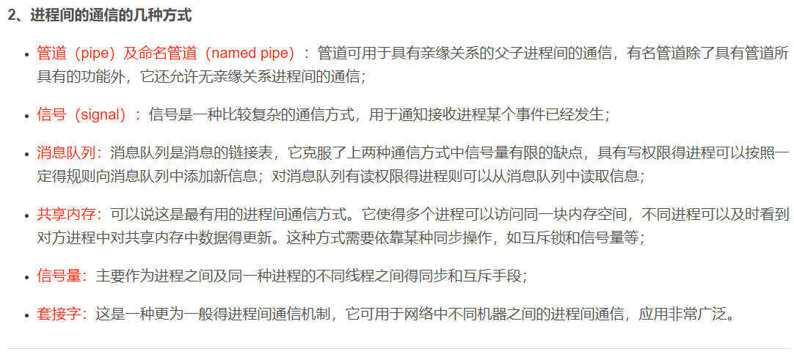
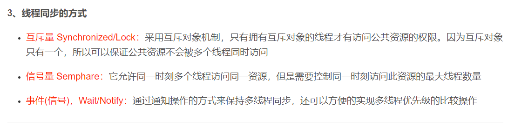
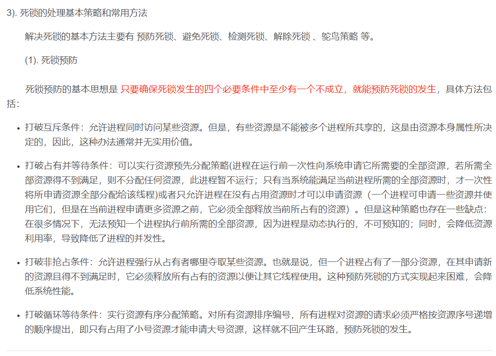
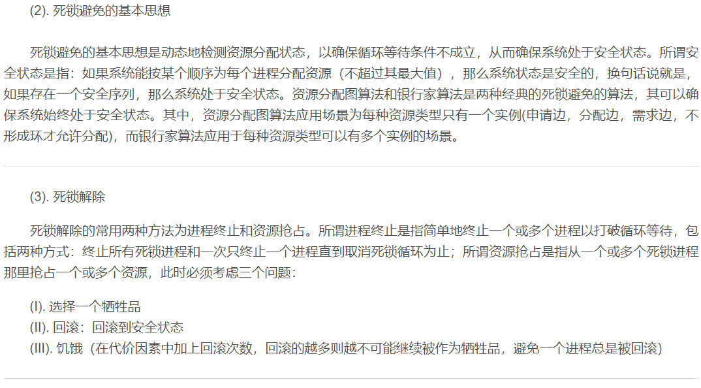
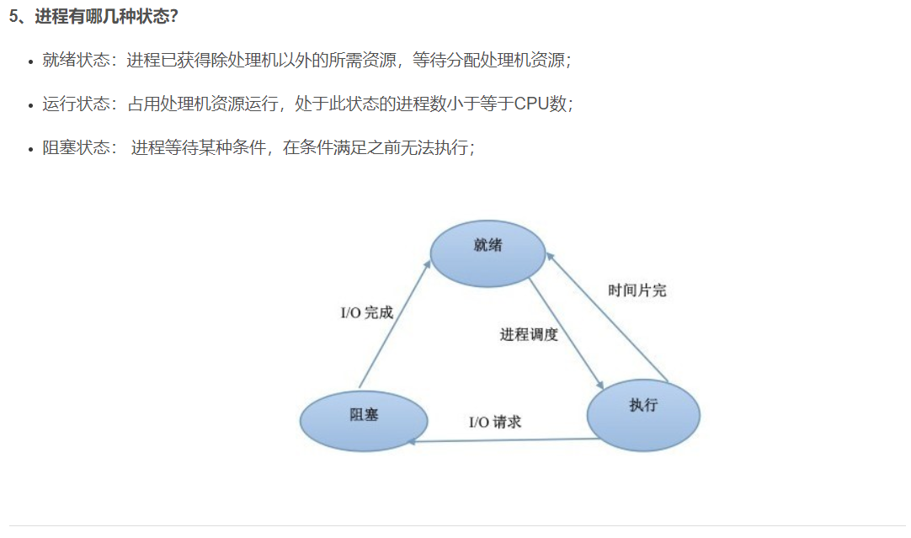
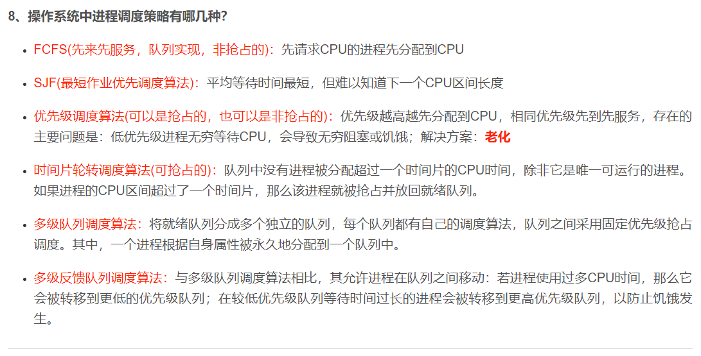
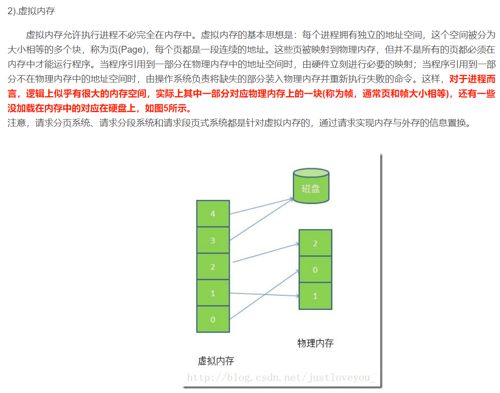
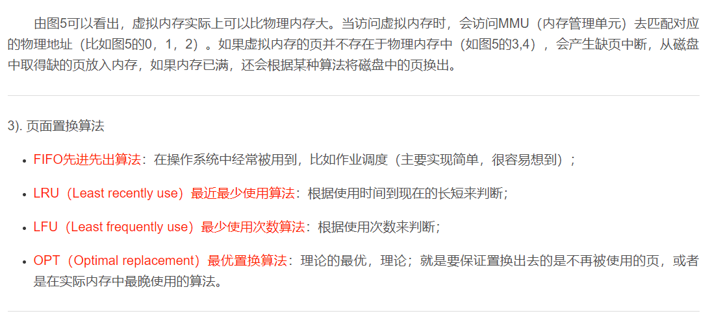
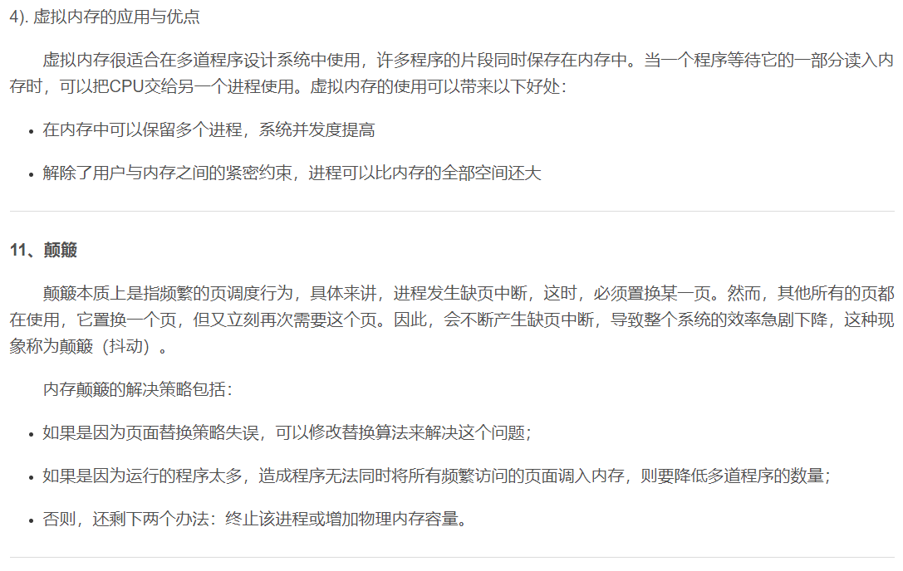

## 操作系统面试问题集锦  
   
## 操作系统常见面试题   
    
### 1.进程的有哪几种状态，状态转换图，及导致转换的事件?   
  
（1）进程的五状态模型：

**运行态**：该进程正在执行。

**就绪态**：进程已经做好了准备，只要有机会就开始执行。

**阻塞态（等待态）**：进程在某些事情发生前不能执行，等待阻塞进程的事件完成。

**新建态**：刚刚创建的进程，操作系统还没有把它加入到可执行进程组中，通常是进程控制块已经创建但是还没有加载到内存中的进程。

**退出态**：操作系统从可执行进程组中释放出的进程，或由于自身或某种原因停止运行。    
   

    
   
（2）上图显示了导致进程状态转换的事件类型，可能的转换如下：  
  
**空->新建**：创建执行一个程序的新进程，可能的事件有：新的批处理作业、交互登录（终端用户登录到系统）、操作系统因为提供一项服务而创建、由现有的进程派生等。

新建->就绪：操作系统准备好再接纳一个进程时，把一个进程从新建态转换为就绪态。

**就绪->运行**：需要选择一个新进程运行时，操作系统的调度器或分配器根据某种调度算法选择一个处于就绪态的进程。

**运行->退出**：导致进程终止的原因有：正常完成、超过时限、系统无法满足进程需要的内存空间、进程试图访问不允许访问的内存单元（越界）、算术错误（如除以0或存储大于硬件可以接纳的数字）、父进程终止（操作系统可能会自动终止该进程所有的后代进程）、父进程请求终止后代进程等。

**运行->就绪**：最常见的原因是，正在运行的进程到达了“允许不中断执行”的最大时间段，该把处理器的资源释放给其他在就绪态的进程使用了；还有一中原因可能是由于具有更改优先级的就绪态进程抢占了该进程的资源，使其被中断转换到就绪态。

**运行->阻塞**：如果进程请求它必须等待的某些事件，例如一个无法立即得到的资源（如I/O操作），只有在获得等待的资源后才能继续进程的执行，则进入等待态（阻塞态）。

**阻塞->就绪**：当等待的事件发生时，处于阻塞态的进程转换到就绪态。

**就绪->退出**：在上图中没有标出这种转换，在某些进程中，父进程可以在任何时刻终止一个子进程，如果一个父进程终止，所有相关的子进程都被终止。

**阻塞->退出**：跟上一项原因类似。    
    
### 2. 进程与线程的区别   
  
* 进程是具有一定功能的程序关于某个数据集合上的一次运行活动，进程是系统进行资源调度和分配的一个独立单位。
* 线程是进程的实体，是CPU调度和分派的基本单位，它是比进程更小的能独立运行的基本单位。
* 一个进程可以有多个线程，多个线程也可以并发执行   

  
### 3. 进程通信的几种方式    
   
进程间通信主要包括管道, 系统IPC(包括消息队列,信号量,共享存储), SOCKET   
   
管道包括三种:   

	1)普通管道PIPE, 通常有种限制,一是半双工,只能单向传输;二是只能在父子进程间使用.    
	2)流管道s_pipe: 去除了第一种限制,可以双向传输.    
	3)命名管道:name_pipe,去除了第二种限制,可以在许多并不相关的进程之间进行通讯.   
    
* 管道( pipe )：管道是一种半双工的通信方式，数据只能单向流动，而且只能在具有亲缘关系的进程间使用。进程的亲缘关系通常是指父子进程关系。

* 有名管道 (namedpipe) ： 有名管道也是半双工的通信方式，但是它允许无亲缘关系进程间的通信。

* 信号量( semophore) ： 信号量是一个计数器，可以用来控制多个进程对共享资源的访问。它常作为一种锁机制，防止某进程正在访问共享资源时，其他进程也访问该资源。因此，主要作为进程间以及同一进程内不同线程之间的同步手段。

* 消息队列( messagequeue ) ： 消息队列是由消息的链表，存放在内核中并由消息队列标识符标识。消息队列克服了信号传递信息少、管道只能承载无格式字节流以及缓冲区大小受限等缺点。

* 信号 ( sinal ) ： 信号是一种比较复杂的通信方式，用于通知接收进程某个事件已经发生。

* 共享内存( sharedmemory ) ：共享内存就是映射一段能被其他进程所访问的内存，这段共享内存由一个进程创建，但多个进程都可以访问。共享内存是最快的 IPC 方式，它是针对其他进程间通信方式运行效率低而专门设计的。它往往与其他通信机制，如信号量，配合使用，来实现进程间的同步和通信。

* 套接字( socket ) ： 套解口也是一种进程间通信机制，与其他通信机制不同的是，它可用于不同机器间的进程通信。    

  
### 4. 什么是死锁？死锁产生的条件？   
    
在两个或者多个并发进程中，如果每个进程持有某种资源而又等待其它进程释放它或它们现在保持着的资源，在未改变这种状态之前都不能向前推进，称这一组进程产生了死锁。通俗的讲就是两个或多个进程无限期的阻塞、相互等待的一种状态。    
   
死锁产生的四个条件（有一个条件不成立，则不会产生死锁）

* 互斥条件：一个资源一次只能被一个进程使用
* 请求与保持条件：一个进程因请求资源而阻塞时，对已获得资源保持不放
* 不剥夺条件：进程获得的资源，在未完全使用完之前，不能强行剥夺
* 循环等待条件：若干进程之间形成一种头尾相接的环形等待资源关系    

### 5. 分页和分段有什么区别？  
   
* 段是信息的逻辑单位，它是根据用户的需要划分的，因此段对用户是可见的 ；页是信息的物理单位，是为了管理主存的方便而划分的，对用户是透明的。
* 段的大小不固定，有它所完成的功能决定；页大大小固定，由系统决定
* 段向用户提供二维地址空间；页向用户提供的是一维地址空间
* 段是信息的逻辑单位，便于存储保护和信息的共享，页的保护和共享受到限制。   
  

    
   
    
   
    
   
    
   
    
   
    
   
    
   
    
   
    
   
    
   
    
   
    
      