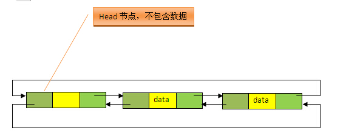
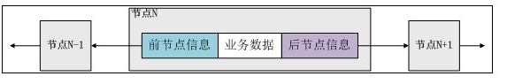
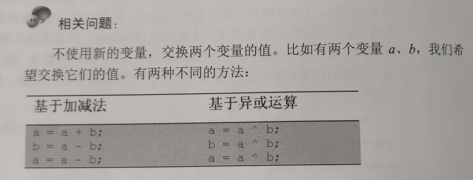

## HashMap底层实现原理(JDK1.8)   
   
>在JDK1.6，JDK1.7中，HashMap采用位桶+链表实现，即使用链表处理冲突，同一hash值的链表都存储在一个链表里。但是当位于一个桶中的元素较多，即hash值相等的元素较多时，通过key值依次查找的效率较低。**而JDK1.8中，HashMap采用位桶+链表+红黑树实现，当链表长度超过阈值（8）时，将链表转换为红黑树，这样大大减少了查找时间。**   

  
### HashMap的实现原理   
  
HashMap实际上是一个“链表散列”的数据结构，即数组和链表的结合体。首先有一个每个元素都是链表（可能表述不准确）的数组，当添加一个元素（key-value）时，就首先计算元素key的hash值，以此确定插入数组中的位置，但是可能存在同一hash值的元素已经被放在数组同一位置了，这时就添加到同一hash值的元素的后面，他们在数组的同一位置，但是形成了链表，同一各链表上的Hash值是相同的，所以说数组存放的是链表。而当链表长度太长时，链表就转换为红黑树，这样大大提高了查找的效率。   
   
当链表数组的容量超过初始容量的0.75时，再散列将链表数组扩大2倍，把原链表数组的搬移到新的数组中。   
   
  
### JDK1.8使用红黑树的改进   

在java jdk8中对HashMap的源码进行了优化，在jdk7中，HashMap处理“碰撞”的时候，都是采用链表来存储，当碰撞的结点很多时，查询时间是O（n）。    
在jdk8中，HashMap处理“碰撞”增加了红黑树这种数据结构，当碰撞结点较少时，采用链表存储，当较大时（>8个），采用红黑树（特点是查询时间是O（logn））存储（有一个阀值控制，大于阀值(8个)，将链表存储转换成红黑树存储）   
   
  
	红黑树的特性:
	（1）每个节点或者是黑色，或者是红色。
	（2）根节点是黑色。
	（3）每个叶子节点（NIL）是黑色。 [注意：这里叶子节点，是指为空(NIL或NULL)的叶子节点！]
	（4）如果一个节点是红色的，则它的子节点必须是黑色的。
	（5）从一个节点到该节点的子孙节点的所有路径上包含相同数目的黑节点。
	
	注意：
	(01) 特性(3)中的叶子节点，是只为空(NIL或null)的节点。
	(02) 特性(5)，确保没有一条路径会比其他路径长出俩倍。因而，红黑树是相对是接近平衡的二叉树。   
   
  
### ArrayList实现原理要点概括   

* ArrayList是List接口的可变数组非同步实现，并允许包括null在内的所有元素。
* 底层使用数组实现
* 该集合是可变长度数组，数组扩容时，会将老数组中的元素重新拷贝一份到新的数组中，每次数组容量增长大约是其容量的1.5倍，这种操作的代价很高。
* 采用了Fail-Fast机制，面对并发的修改时，迭代器很快就会完全失败，而不是冒着在将来某个不确定时间发生任意不确定行为的风险
* remove方法会让下标到数组末尾的元素向前移动一个单位，并把最后一位的值置空，方便GC   

   
### LinkedList数据结构原理   
  
LinkedList底层的数据结构是基于双向循环链表的，且头结点中不存放数据,如下：   
  
   
  
既然是双向链表，那么必定存在一种数据结构——我们可以称之为节点，节点实例保存业务数据，前一个节点的位置信息和后一个节点位置信息，如下图所示：     
   
   
  
   
### String、StringBuffer、StringBuilder   
   
#### 一、String
可以看到String类、以及value都是final类型的，这样就表明String是无法被继承的，value是无法被改写的。当通过String的构造函数初始化新的String对象时，也只是根据传入的引用对象的value和hashcode进行了赋值。   
   
  
#### 二、StringBuilder   
  
可以看到StringBuilder的value是个char数组，（当然从JDK9开始，value从char数组变成了byte数组）。每次append时都是通过调用native的System.arraycopy实现的（在getChars中调用的）。   
   
#### 三、StringBuffer    
   
和StringBuilder一样，都是用了char数组保存value，append也是调用了AbstractStringBuilder的append方法。区别只是在于char数组加了transient关键字，以及方法上加了synchronized方法。

综上所述，String、StringBuilder、StringBuffer的使用场景如下：

* 当处理定长字符串时，建议用String；
* 当处理变长字符串时，并且是单线程环境时，建议用StringBuilder；
* 当处理变长字符串时，并且是多线程环境时，建议用StringBuffer。   

---
线程不安全HashMap，线程安全ConcurrentHashMap，有序TreeMap，实现ThreadLoacl用的WeakHashMap   
   
   
### Java与C++的异同点总结   
  
#### 主要不同点：

1、Java为解释性语言，其运行过程为：程序源代码经过Java编译器编译成字节码，然后由JVM解释执行。而C/C++为编译型语言，源代码经过编译和链接后生成可执行的二进制代码，可直接执行。因此Java的执行速度比C/C++慢，但Java能够跨平台执行，C/C++不能。

2、Java是纯面向对象语言，所有代码（包括函数、变量）必须在类中实现，除基本数据类型（包括int、float等）外，所有类型都是类。此外，Java语言中不存在全局变量或者全局函数，而C++兼具面向过程和面向对象编程的特点，可以定义全局变量和全局函数。

3、与C/C++语言相比，Java语言中没有指针的概念，这有效防止了C/C++语言中操作指针可能引起的系统问题，从而使程序变得更加安全。

4、与C++语言相比，Java语言不支持多重继承，但是Java语言引入了接口的概念，可以同时实现多个接口。由于接口也有多态特性，因此Java语言中可以通过实现多个接口来实现与C++语言中多重继承类似的目的。

5、在C++语言中，需要开发人员去管理内存的分配（包括申请和释放），而Java语言提供了垃圾回收器来实现垃圾的自动回收，不需要程序显示地管理内存的分配。在C++语言中，通常会把释放资源的代码放到析构函数中，Java语言中虽然没有析构函数，但却引入了一个finalize()方法，当垃圾回收器要释放无用对象的内存时，会首先调用该对象的finalize()方法，因此，开发人员不需要关心也不需要知道对象所占的内存空间何时被释放。   
   
   
#### 其他不同点：

1>C++语言支持运算符重载；Java不支持运算符重载。

2>C++语言支持预处理；Java没有预处理器，虽然不支持与处理功能（包括头文件、宏定义等），但它提供的import机制与C++的预处理器功能类似。

3>C++支持默认函数参数；Java不支持默认函数参数。

4>C/C++支持goto语句；Java不提供goto语句，但Java中的goto是保留关键字。

5>C/C++支持自动强制类型转换，这会导致程序的不安全；Java不支持自动强制类型转换，必须由开发人员显式地进行强制类型转换。

6>C/C++中，结构和联合的所有成员均为公有，这往往会导致安全性问题的发生；而Java根本就不包含结构和联合，所有内容都封装在类里面。  
   
   
1>Java具有平台无关性，即对每种数据类型都分配固定长度的空间，例如int型总是占据32位；而C/C++不然，同一个数据类型在不同平台上会分配不同的字节数。

2>Java提供对注释文档的内建支持，所以源码文件也可以包含它们自己的文档。通过一个单独的程序，这些文档可以提取出来，并重新格式化为HTML。

3>Java包含了一些标准库，用于完成特定的任务，同时这些库简单易用，能够大大缩短开发周期。例如，Java提供了用于访问数据库的JDBC库，用于实现分布式对象的RMI等标注库。C++则依靠一些非标准的、由其他厂商提供的库。   
  
  
   