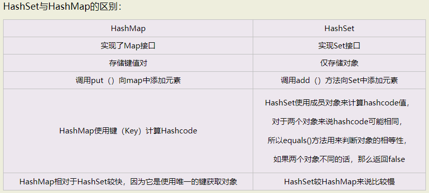
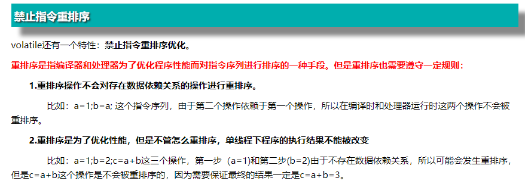
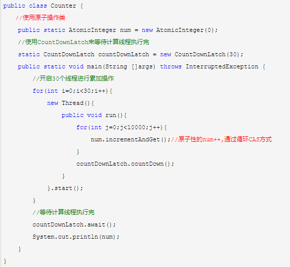
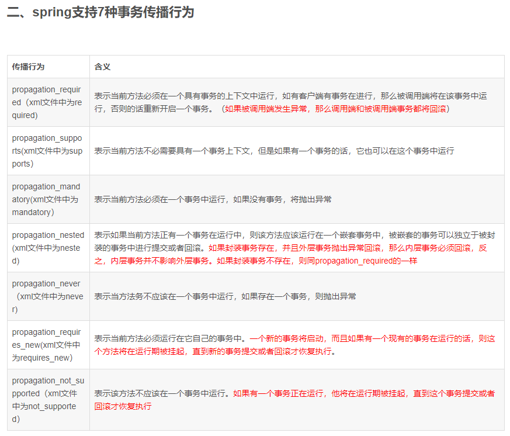
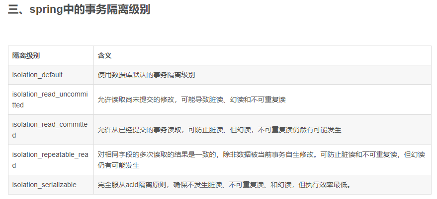

## HashSet与HashMap的区别   
   
HashSet：

　　HashSet实现了Set接口，它不允许集合中出现重复元素。当我们提到HashSet时，第一件事就是在将对象存储在HashSet之前，要确保重写hashCode（）方法和equals（）方法，这样才能比较对象的值是否相等，确保集合中没有储存相同的对象。如果不重写上述两个方法，那么将使用下面方法默认实现：

　　public boolean add(Object obj)方法用在Set添加元素时，如果元素值重复时返回 "false"，如果添加成功则返回"true"   
   
  
HashMap：

　　HashMap实现了Map接口，Map接口对键值对进行映射。Map中不允许出现重复的键（Key）。Map接口有两个基本的实现TreeMap和HashMap。TreeMap保存了对象的排列次序，而HashMap不能。HashMap可以有空的键值对（Key（null）-Value（null））HashMap是非线程安全的（非Synchronize），要想实现线程安全，那么需要调用collections类的静态方法synchronizeMap（）实现。

public Object put(Object Key,Object value)方法用来将元素添加到map中。    
   
  
   
   
  
## Volatile原理   
   
Java语言提供了一种稍弱的同步机制，即volatile变量，用来确保将变量的更新操作通知到其他线程。当把变量声明为volatile类型后，编译器与运行时都会注意到这个变量是共享的，**因此不会将该变量上的操作与其他内存操作一起重排序。**volatile变量不会被缓存在寄存器或者对其他处理器不可见的地方，因此在读取volatile类型的变量时总会返回最新写入的值。   
  
　　当对非 volatile 变量进行读写的时候，每个线程先从内存拷贝变量到CPU缓存中。如果计算机有多个CPU，每个线程可能在不同的CPU上被处理，这意味着每个线程可以拷贝到不同的 CPU cache 中。

　　**而声明变量是 volatile 的，JVM 保证了每次读变量都从内存中读，跳过 CPU cache 这一步。**   
  
  
    
---
  
## 解决num++操作的原子性问题   
  
针对num++这类复合类的操作，可以使用java并发包中的原子操作类原子操作类是通过循环CAS的方式来保证其原子性的。  
  
   
   
执行结果

300000   
  
  
## BIO与NIO、AIO的区别   
   
IO的方式通常分为几种，同步阻塞的BIO、同步非阻塞的NIO、异步非阻塞的AIO。

一、BIO

  在JDK1.4出来之前，我们建立网络连接的时候采用BIO模式，需要先在服务端启动一个ServerSocket，然后在客户端启动Socket来对服务端进行通信，默认情况下服务端需要对每个请求建立一堆线程等待请求，而客户端发送请求后，先咨询服务端是否有线程相应，如果没有则会一直等待或者遭到拒绝请求，如果有的话，客户端会线程会等待请求结束后才继续执行。   
  
  
二、NIO

  NIO本身是基于事件驱动思想来完成的，其主要想解决的是BIO的大并发问题： 在使用同步I/O的网络应用中，如果要同时处理多个客户端请求，或是在客户端要同时和多个服务器进行通讯，就必须使用多线程来处理。也就是说，将每一个客户端请求分配给一个线程来单独处理。这样做虽然可以达到我们的要求，但同时又会带来另外一个问题。由于每创建一个线程，就要为这个线程分配一定的内存空间（也叫工作存储器），而且操作系统本身也对线程的总数有一定的限制。如果客户端的请求过多，服务端程序可能会因为不堪重负而拒绝客户端的请求，甚至服务器可能会因此而瘫痪。

  NIO基于Reactor，当socket有流可读或可写入socket时，操作系统会相应的通知引用程序进行处理，应用再将流读取到缓冲区或写入操作系统。  也就是说，这个时候，已经不是一个连接就要对应一个处理线程了，而是有效的请求，对应一个线程，当连接没有数据时，是没有工作线程来处理的。

  BIO与NIO一个比较重要的不同，是我们使用BIO的时候往往会引入多线程，每个连接一个单独的线程；而NIO则是使用单线程或者只使用少量的多线程，每个连接共用一个线程。   
   
  NIO的最重要的地方是当一个连接创建后，不需要对应一个线程，这个连接会被注册到多路复用器上面，所以所有的连接只需要一个线程就可以搞定，当这个线程中的多路复用器进行轮询的时候，发现连接上有请求的话，才开启一个线程进行处理，也就是一个请求一个线程模式。

  在NIO的处理方式中，当一个请求来的话，开启线程进行处理，可能会等待后端应用的资源(JDBC连接等)，其实这个线程就被阻塞了，当并发上来的话，还是会有BIO一样的问题。

  HTTP/1.1出现后，有了Http长连接，这样除了超时和指明特定关闭的http header外，这个链接是一直打开的状态的，这样在NIO处理中可以进一步的进化，在后端资源中可以实现资源池或者队列，当请求来的话，开启的线程把请求和请求数据传送给后端资源池或者队列里面就返回，并且在全局的地方保持住这个现场(哪个连接的哪个请求等)，这样前面的线程还是可以去接受其他的请求，而后端的应用的处理只需要执行队列里面的就可以了，这样请求处理和后端应用是异步的.当后端处理完，到全局地方得到现场，产生响应，这个就实现了异步处理。   
   
   
三、AIO

  与NIO不同，当进行读写操作时，只须直接调用API的read或write方法即可。这两种方法均为异步的，对于读操作而言，当有流可读取时，操作系统会将可读的流传入read方法的缓冲区，并通知应用程序；对于写操作而言，当操作系统将write方法传递的流写入完毕时，操作系统主动通知应用程序。  即可以理解为，read/write方法都是异步的，完成后会主动调用回调函数。  在JDK1.7中，这部分内容被称作NIO.2，主要在java.nio.channels包下增加了下面四个异步通道：   
   
  
Java对BIO、NIO、AIO的支持：

* Java BIO ： 同步并阻塞，服务器实现模式为一个连接一个线程，即客户端有连接请求时服务器端就需要启动一个线程进行处理，如果这个连接不做任何事情会造成不必要的线程开销，当然可以通过线程池机制改善。

* Java NIO ： 同步非阻塞，服务器实现模式为一个请求一个线程，即客户端发送的连接请求都会注册到多路复用器上，多路复用器轮询到连接有I/O请求时才启动一个线程进行处理。

* Java AIO(NIO.2) ： 异步非阻塞，服务器实现模式为一个有效请求一个线程，客户端的I/O请求都是由OS先完成了再通知服务器应用去启动线程进行处理，

BIO、NIO、AIO适用场景分析:

* BIO方式适用于连接数目比较小且固定的架构，这种方式对服务器资源要求比较高，并发局限于应用中，JDK1.4以前的唯一选择，但程序直观简单易理解。

* NIO方式适用于连接数目多且连接比较短（轻操作）的架构，比如聊天服务器，并发局限于应用中，编程比较复杂，JDK1.4开始支持。

* AIO方式使用于连接数目多且连接比较长（重操作）的架构，比如相册服务器，充分调用OS参与并发操作，编程比较复杂，JDK7开始支持。   

   
   
   
   
  
  
## 特点

### Redis

  支持多种数据结构，如 string（字符串）、 list(双向链表)、dict(hash表)、set(集合）、zset(排序set)、hyperloglog（基数估算）；  
  支持持久化操作，可以进行aof及rdb数据持久化到磁盘，从而进行数据备份或数据恢复等操作，较好的防止数据丢失的手段； 
  支持通过Replication进行数据复制，通过master-slave机制，可以实时进行数据的同步复制，支持多级复制和增量复制，master-slave机制是Redis进行HA的重要手段；   
  单线程请求，所有命令串行执行，并发情况下不需要考虑数据一致性问题；  
  支持pub/sub消息订阅机制，可以用来进行消息订阅与通知；  
  支持简单的事务需求，但业界使用场景很少，并不成熟。  

  Redis只能使用单线程，性能受限于CPU性能，故单实例CPU最高才可能达到5-6wQPS每秒（取决于数据结构，数据大小以及服务器硬件性能，日常环境中QPS高峰大约在1-2w左右）；  

  支持简单的事务需求，但业界使用场景很少，并不成熟，既是优点也是缺点；

  支持（快照、AOF）：依赖快照进行持久化，AOF增强了可靠性的同时，对性能有所影响；  

  Redis在string类型上会消耗较多内存，可以使用dict（hash表）压缩存储以降低内存耗用；

  MC和Redis都是Key-Value类型，不适合在不同数据集之间建立关系，也不适合进行查询搜索。比如redis的keys pattern这种匹配操作，对redis的性能是灾难；

  Redis在2.0版本后增加了自己的VM特性，突破物理内存的限制；可以对key value设置过期时间（类似memcache）；

  Redis事务支持比较弱，只能保证事务中的每个操作连续执行，

### MongoDB

　　适合大数据量的存储，依赖操作系统VM做内存管理，吃内存也比较厉害，服务不要和别的服务在一起；

　　支持丰富的数据表达，索引，最类似关系型数据库，支持的查询语言非常丰富；

　　支持master-slave,replicaset（内部采用paxos选举算法，自动故障恢复）,auto sharding机制，对客户端屏蔽了故障转移和切分机制；

　　从1.8版本开始采用binlog方式支持持久化的可靠性；

　　MongoDB不支持事务；

　　MongoDB内置了数据分析的功能(mapreduce),其他不支持