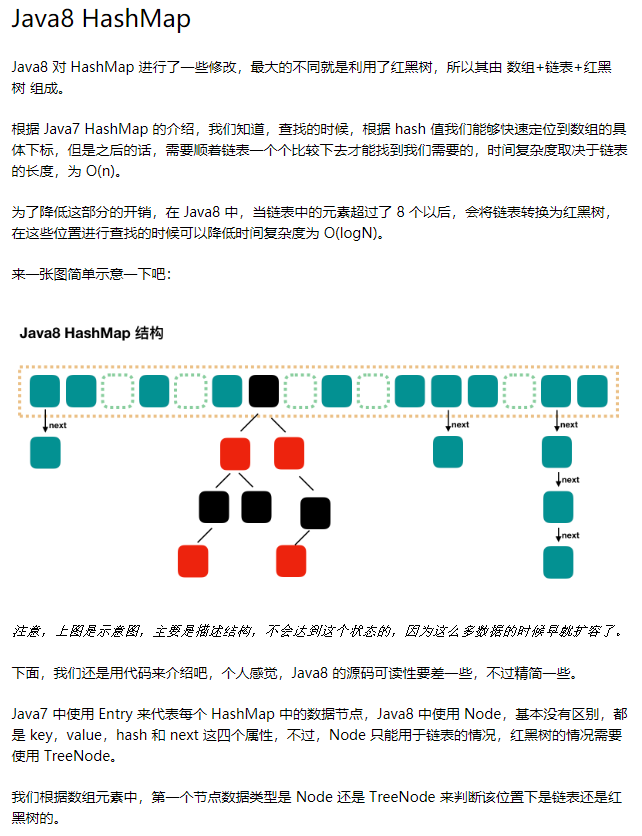

## Runnable和Callable的区别和用法  
  
   
  
   
   
   
## HashMap和TreeMap的区别
   
HashMap：数组方式存储key/value，线程非安全，允许null作为key和value，key不可以重复，value允许重复，不保证元素迭代顺序是按照插入时的顺序，key的hash值是先计算key的hashcode值，然后再进行计算，每次容量扩容会重新计算所以key的hash值，会消耗资源，要求key必须重写equals和hashcode方法

默认初始容量16，加载因子0.75，扩容为旧容量乘2，查找元素快，如果key一样则比较value，如果value不一样，则按照链表结构存储value，就是一个key后面有多个value；

TreeMap：基于红黑二叉树的NavigableMap的实现，线程非安全，不允许null，key不可以重复，value允许重复，存入TreeMap的元素应当实现Comparable接口或者实现Comparator接口，会按照排序后的顺序迭代元素，两个相比较的key不得抛出classCastException。主要用于存入元素的时候对元素进行自动排序，迭代输出的时候就按排序顺序输出   
   
## 红黑树  
  
**红黑树是一种近似平衡的二叉查找树，它能够确保任何一个节点的左右子树的高度差不会超过二者中较低那个的一陪。**具体来说，红黑树是满足如下条件的二叉查找树（binary search tree）：   
   
* 每个节点要么是红色，要么是黑色。
* 根节点必须是黑色
* 红色节点不能连续（也即是，红色节点的孩子和父亲都不能是红色）。
* 对于每个节点，从该点至null（树尾端）的任何路径，都含有相同个数的黑色节点。
  
在树的结构发生改变时（插入或者删除操作），往往会破坏上述条件3或条件4，需要通过调整使得查找树重新满足红黑树的条件。   
   
  
红黑树的**查询性能略微逊色于AVL树，因为他比avl树会稍微不平衡最多一层，**也就是说红黑树的查询性能只比相同内容的avl树最多多一次比较，但是，红黑树在插入和删除上完爆avl树，avl树每次插入删除会进行大量的平衡度计算，而红黑树为了维持红黑性质所做的红黑变换和旋转的开销，相较于avl树为了维持平衡的开销要小得多。   
   
如果插入一个node引起了树的不平衡，AVL和RB-Tree都是最多只需要2次旋转操作，即两者都是O(1)；但是在删除node引起树的不平衡时，最坏情况下，AVL需要维护从被删node到root这条路径上所有node的平衡性，因此需要旋转的量级O(logN)，而RB-Tree最多只需3次旋转，只需要O(1)的复杂度。

   
  
    
   
    
    
## Java8 ConcurrentHashMap  

    