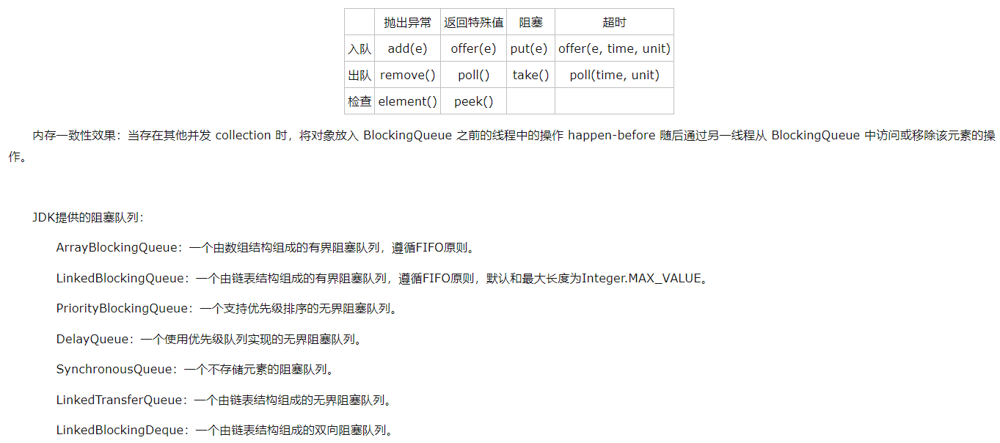
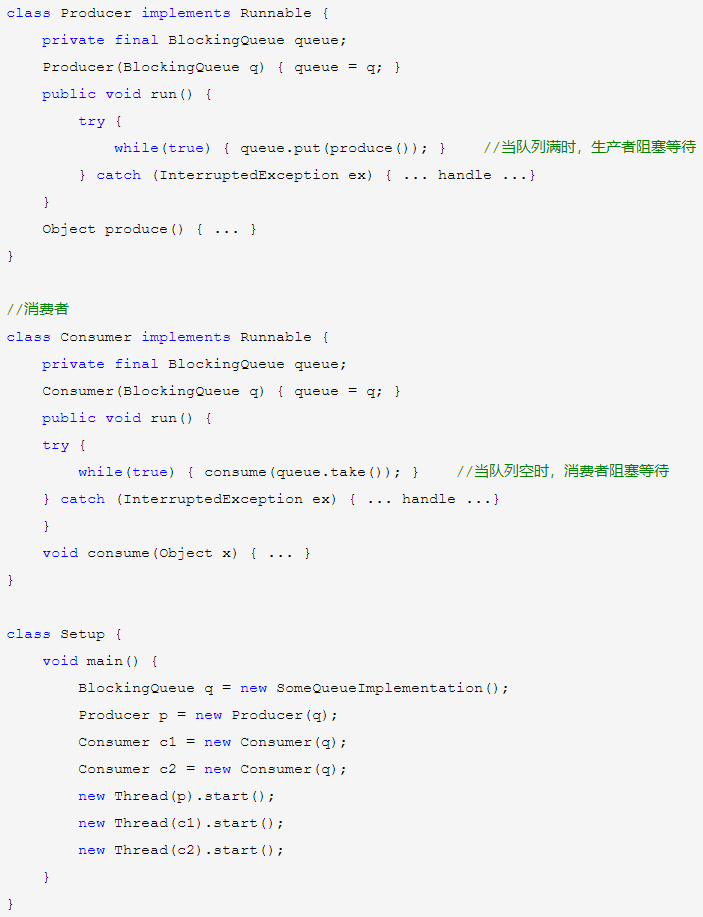
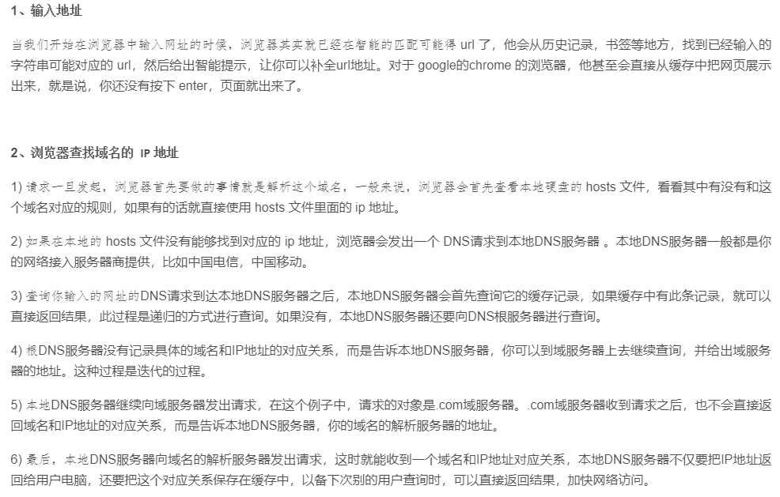
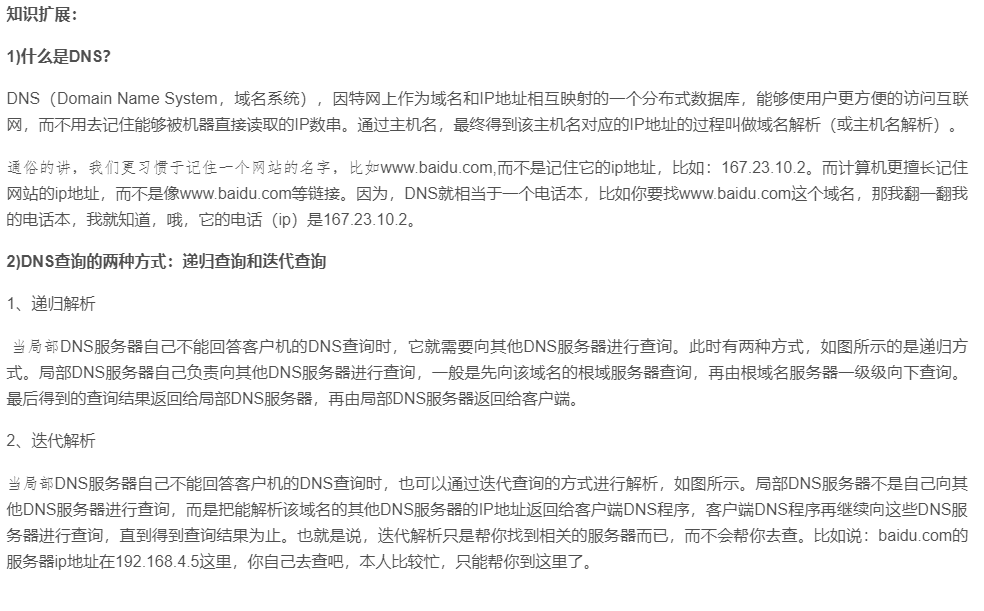
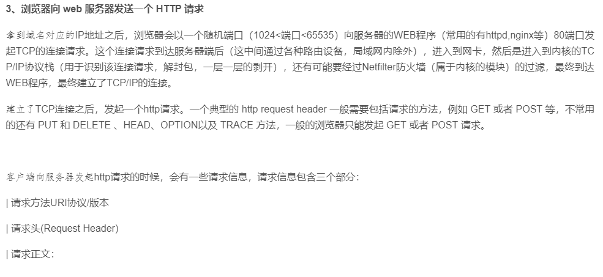

## BlockingQueue（阻塞队列）  
  
在新增的Concurrent包中，BlockingQueue很好的解决了多线程中，如何高效安全“传输”数据的问题。通过这些高效并且线程安全的队列类，为我们快速搭建高质量的多线程程序带来极大的便利。   

BlockingQueue支持两个附加操作的Queue：1）当Queue为空时，获取元素线程被阻塞直到Queue变为非空；2）当Queue满时，添加元素线程被阻塞直到Queue不满。BlockingQueue不允许元素为null，如果入队一个null元素，会抛NullPointerException。常用于生产者消费者模式。     
  
BlockingQueue对于不能满足条件的操作，提供了四种处理方式：

1）直接抛异常，抛出异常。如果队列已满，添加元素会抛出IllegalStateException异常；如果队列为空，获取元素会抛出NoSuchElementException异常；

2）返回一个特殊值（null或false）；

3）在满足条件之前，无限期的阻塞当前线程，当队列满足条件或响应中断退出；

4）在有限时间内阻塞当前线程，超时后返回失败   
   

    

 
使用示例：生产者-消费者，BlockingQueue 可以安全地与多个生产者和多个使用者一起使用。   
  
   

  

## 输入网址到网页显示的过程是什么？

从用户输入一个网址到网页最终展现到用户面前，中间的大致流程总结如下：  

1) 在客户端浏览器中输入网址URL。  
2) 发送到DNS(域名服务器)获得域名对应的WEB服务器的IP地址。  
3) 客户端浏览器与WEB服务器建立TCP(传输控制协议)连接。  
4) 客户端浏览器向对应IP地址的WEB服务器发送相应的HTTP或HTTPS请求。  
5) WEB服务器响应请求，返回指定的URL数据或错误信息；如果设定重定向，则重定向到新的URL地址。  
6) 客户端浏览器下载数据，解析HTML源文件，解析的过程中实现对页面的排版，解析完成后，在浏览器中显示基础的页面。  
7) 分析页面中的超链接，显示在当前页面，重复以上过程直至没有超链接需要发送，完成页面的全部显示。  
  

   
  
   
  
    
  
